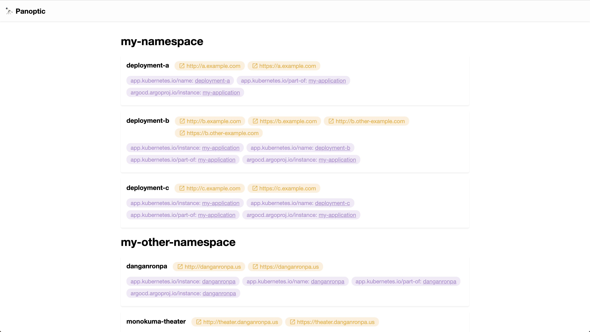

# Panoptic

> Showing or seeing the whole at one view.

Panoptic provides a useful display of your deployments.



## Usage

### From Source

Clone the repository:

```shell
git clone https://github.com/jakehamilton/panoptic.git

cd panoptic
```

Install dependencies:

```shell
yarn
```

Run the application (for configuration help):

```shell
# With Yarn
yarn start --help

# Or directly
node src/index.js --help
```
